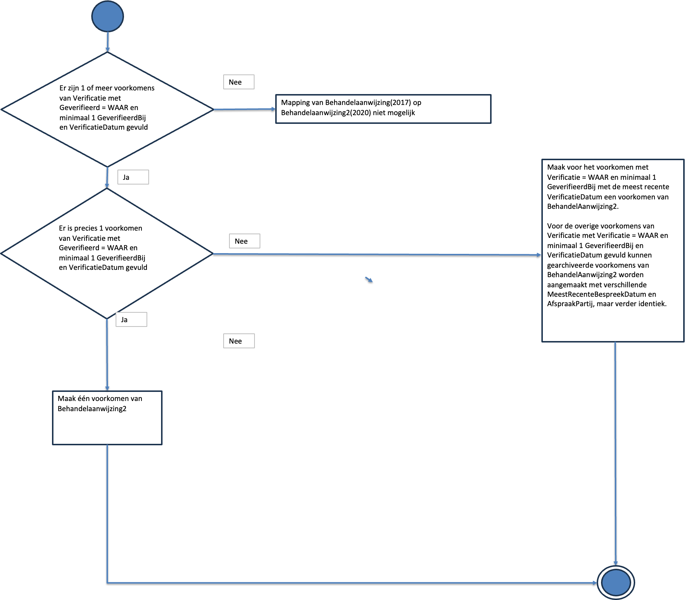

## Behandelaanwijzing-Behandelaanwijzing2

# Memo met uitgangspunten

|Aan: |Stakeholders mapping BehandelAanwijzing 2017 en 2020|
|-|-|  
|Van: |Nictiz|   
|Datum: |26 augustus 2025|  
|Versie: |0.4.0|  
|Onderwerp: |Mapping BehandelAanwijzing zibs 2017 en 2020|

### Kern
Voor uitwisseling van de behandelaanwijzing is door de PZP coalitie gekozen voor het gebruik van de 2020 zib BehandelAanwijzing2. Op basis van deze zib is ook het HL7 FHIR R4 profiel uitgewerkt. In het 2e lijns domein, bijvoorbeeld in de BgZ MSZ, wordt de behandelaanwijzing geregistreerd en uitgewisseld met het model van de zib 2017 BehandelAanwijzing-v3.1.  2017 BehandelAanwijzing-v3.1. 
Om zorgaanbieders die registreren volgens modellen van verschillende baselines in staat te stellen om Behandelaanwijzingen uit te wisselen zijn er mappings gemaakt van het 2017 model naar het 2020 model en vice versa. 
Bij het maken van de mapping van de sectie Verificatie (zib 2017) naar de sectie AfspraakPartij en het element MeestRecenteBespreekdatum (zib 2020) zijn een aantal uitgangspunten gehanteerd. Deze worden in dit memo toegelicht.
#### Toelichting
De modellen van de zibs 2017 en 2020 van de BehandelAanwijzing verschillen op een aantal elementen. De kern is echter gelijk: er is een specifieke behandeling waarop een aanwijzing geldt of deze wel (ja) of niet (nee) mag worden uitgevoerd in het geval van een (acute) zorgsituatie. In specifieke gevallen kan met een tekstuele beschrijving hiervan een verbijzondering worden aangegeven. De verschillen in de modellen komen voort uit de procedure waarop de behandelaanwijzing tot stand is gekomen.

In de 2017 versie is het mogelijk om de Behandelaanwijzing zonder verificatie te registreren en uit te wisselen. In de 2020 versie is dat niet meer mogelijk.
In het 2020 model is er op één contactmoment een gesprek tussen een arts en een patiënt (en/of diens vertegenwoordiger(s)) waarbij gezamenlijk een afspraak wordt geregistreerd per behandeling of deze wel of niet mag worden uitgevoerd. De partijen met wie de afspraak is gemaakt en de datum waarop dat is gebeurd worden op dat moment geregistreerd. Die registratie is een verplicht onderdeel van Behandelaanwijzing2.

De mapping van het 2017 model op het 2020 model is gebaseerd op het uitgangspunt dat een Behandelaanwijzing (2017) voordat verificatie heeft plaatsgevonden niet gezien kan worden als een behandelaanwijzing in de zin van het 2020 model, omdat de partijen met wie de Behandelaanwijzing is afgesproken, niet zijn geregistreerd. Het moment van verificatie door een patiënt (en/of diens vertegenwoordiger(s)) kan echter worden gezien als een afspraak. Immers, op het moment van verificatie hebben zowel de patiënt (en/of diens vertegenwoordiger(s)) als de arts inspraak gehad op het beleid en maakt het dat het een behandelaanwijzing wordt. Indien een patiënt (en/of diens vertegenwoordiger(s)) het niet eens is met het beleid van de arts, is er ook geen verificatie en dus geen behandelaanwijzing in de betekenis van BehandelAanwijzing2 (2020).
Het effect van het verifiëren van de aanwijzing is hetzelfde als het maken van een afspraak over een behandelaanwijzing. En daarmee is ook de datum van de verificatie (zib 2017) hetzelfde als de meest recente bespreekdatum van de afspraak (zib 2020).

Bij het maken van de mapping van de sectie Verificatie (zib 2017) naar de sectie AfspraakPartij en het element MeestRecenteBespreekdatum (zib 2020) zijn dan ook de volgende uitgangspunten gehanteerd:
+ De verificaties met ‘Geverifieerd = Nee’ moeten worden genegeerd en worden niet gebruikt bij de mapping naar BehandelAanwijzing2 (2020)..
+ De BeginDatum in de zib BehandelAanwijzing (2017) slaat op het moment dat de behandelaanwijzing van kracht is geworden. . Omdat de behandelaanwijzing in de betekenis van BehandelAanwijzing2 (2020) pas geldt op het moment van verificatie, is de BeginDatum niet van inhoudelijke betekenis voor de behandelaanwijzing in de betekenis van BehandelAanwijzing2 (2020).
+ In de zib BehandelAanwijzing (2017) is de Verificatie ook niet vereist. Dit maakt het dat er al een registratie van een aanwijzing kan plaatsvinden en ook als zodanig kan worden uitgewisseld. Echter, dit is dan géén behandelaanwijzing in de betekenis van Behandelaanwijzing2 (2020). Een BehandelAanwijzing (2017) zonder Verificatie kan dus niet worden gemapt op BehandelAanwijzing2 (2020).
+ In de zib Behandelaanwijzing (2017) zijn de gegevenselementen GeverifieerdBij en VerificatieDatum niet vereist. In BehandelAanwijzing2 (2020) is registratie verplicht van de partijen waarmee de afspraak gemaakt is. Een BehandelAanwijzing(2017) waarvan de meest recente verificatie of de GeverifieerdBij partij van de meest recente verificatie niet kan worden bepaald kan dan ook niet worden gemapt op een BehandelAanwijzing2 (2020).
+ In BehandelAanwijzing2 (2020) is registratie van een Zorgverlener als AfspraakPartij verplicht. In BehandelAanwijzing (2017) bestaat geen equivalent gegevenselement. De beste benadering hiervoor is te vinden in de metagegevens van de BehandelAanwijzing, die gemodelleerd zijn met de zib BasisElementen (2017), namelijk de auteur van de versie waarin de meest recente Verificatie is toegevoegd. Als de auteur van de geverifieerde versie van de BehandelAanwijzing (2017) niet kan worden bepaald, is er geen mapping mogelijk naar BehandelAanwijzing2 (2020). 

### Afsluiting
Dit memo wordt bijgevoegd bij de publicatie van de mapping van de 2017 en 2020 zibs voor BehandelAanwijzing. 
De inhoud van dit memo dient breed gedragen te worden door alle zorgdomeinen. Vooralsnog is dit memo een leidraad; middels accordatie – al dan niet na verdere aanvullingen – kan dit memo als richtlijn worden beschouwd.

# Stroomdiagram 

